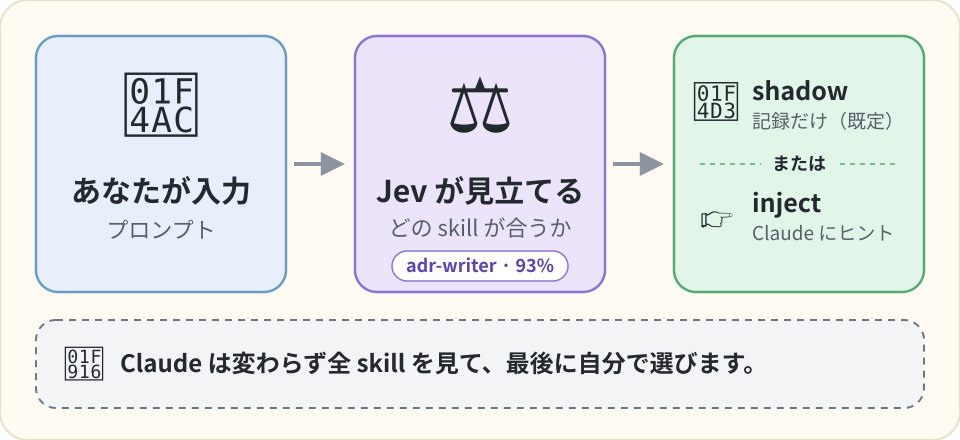

[English](README.md) | **日本語**

# jev-skill-router

インストール済みの skill のうちどれがプロンプトに合うかを、TypeSafe の高速な確率モデル Jev に尋ね、その答えをログに残す Claude Code の hook です。答えを Claude に伝えるのは、そう設定したときだけです。実験として公開しています。動かした結果、強いモデルの router としては役に立つ見込みが小さいと分かり、その理由をこの README に書いています。

[](https://github.com/shimo4228/jev-skill-router/actions/workflows/tests.yml)
[](LICENSE)

<p align="center">
  
</p>

jev-skill-router は、skill を何十本も入れていて、合う skill をモデルが使わずに済ませてしまうことがある人のための Claude Code プラグインです。プロンプトを送るたびに `UserPromptSubmit` hook が、プロンプトと skill の名簿を [TypeSafe](https://typesafe.ai) の Jev モデルへ送ります。Jev は文章を書かず、答えの決まった質問（Yes/No や、一覧から 1 つ選ぶ質問）に確率で答えるモデルです。その確率をコードが読み、skill を最大 1 本だけ名指しするか、何も名指ししません。最後に選ぶのは、変わらず全 skill を見ている Claude です。Python 3.10 以上、標準ライブラリのみ、MIT ライセンス、バージョン 0.2.0 で、まだ実験段階です。

**インストールの前に読んでください。** 公開しているのは、動く参考実装と計測器としてです。同じことを考える人が、私たちが確かめたところから始められるようにするためです。既定は **shadow モード**で、提案するとしたら選んでいた skill を記録するだけで、何も注入しません。そのログを、各セッションで実際に使った skill と突き合わせられます。動かして分かったことと、Claude Code の skill 一覧を書き換える手前で止めた理由は、記事「[JevのスキルルーターをClaude Codeに足して、スキル一覧を書き換える手前で引き返した](https://zenn.dev/shimo4228/articles/jev-retrofit-limits)」（[英語版](https://dev.to/shimo4228/i-added-jevs-skill-router-to-claude-code-and-turned-back-just-before-rewriting-the-skill-listing-34in)）に書きました。Jev を使ったほかの実験は「[著者のほかの仕事](#著者のほかの仕事)」にあります。

## 動かして分かったこと

**Claude Code 自身の skill 選択は、置き換えられません。** `UserPromptSubmit` hook にできるのは、ターンに文章を足すこと（とプロンプトを止めること）で、skill 一覧は変えられません。Claude Code は引き続き全 skill の説明（description）をモデルに見せ、選ぶのはモデルです。router はその横で並走します。skill 一覧に使われるトークンは、1 つも減りません。

**TypeSafe の手順の前提は、そのまま当てはまりません。** この router は、TypeSafe の [skill suggestion cookbook](https://docs.typesafe.ai/cookbooks/skill_suggestion) を移植したものです。TypeSafe の実験では、agent は `claude-haiku-4-5` で、見えていたのは skill 1 本あたり 60 文字に切られた索引でした。だから、全文を読める別の読み手が足せるものがありました。Claude Code は、各 skill の説明を 1,536 文字までモデルに見せます（[skills の docs](https://code.claude.com/docs/en/skills)、2026-09-21 確認）。ここでは router は、同じ説明をすでに見ている強いモデルに、より弱い判定器（[Opus と比べた測定](https://zenn.dev/shimo4228/articles/jev-vs-opus-skill-selection)）が助言する形になります。router が足せる情報は、`SKILL.md` の本文と、1,536 文字の上限を超えた説明の残りです。

**測ったこと**（すべて 2026-09-21、著者自身の名簿 50〜59 本、`jev-1.13.0`、プロンプトは日本語。名簿のうち著者が自作した skill は [claude-harness](https://github.com/shimo4228/claude-harness) で公開しています）:

- 意図が 1 つの依頼文（「この設計判断を ADR として記録したい」など）を用意して流した場合: 0.2.0 で 6 件中 6 件が妥当でした。5 件は人が選ぶであろう skill を、適合度（その skill が頼まれた具体的なことをする、と Jev が答えた確率）0.93〜0.98 で名指しし、お礼の一言には正しく何も提案しませんでした。
- 著者の実際のセッション（0.1.0、shadow モード）: 6 件中 3 件が妥当、3 件が外れでした。外れたのは、会話の途中の受け答え（「なぜそのガードを入れたのか」など）で、著者自身のセッションの大半はこういう発話です。router の最初の関門（gate）は、点数が 0.30 未満ならそこで止まります。この 3 件には 0.34〜0.64 と、skill が要るかのような点を付けました。3 件とも、Jev が選んだ 1 本と、適合度が最も高い候補も食い違っていました（「判定のしかた」を見てください）。
- 実セッションの 6 行は逸話であって、率ではありません。それでも載せるのは、このプロジェクトが持っている実セッションのデータが、これだけだからです。この 6 行は、切り詰めた文章で順位付けしていた 0.1.0 のものです。実セッションは 0.2.0 では取り直していません。版の違うログの行は混ぜずに分けて読むので、ここでも分けて書いています。

**それでも役に立つかもしれない場面。** モデルが skill を使わない理由が、「間違った skill を選ぶ」ことではなく「skill を読まずに自分でやってしまう」ことにあるなら、ターンごとの名指しは、情報としてではなく、きっかけとして働きます。shadow のログをセッション記録と突き合わせれば、この 2 つを見分けられます（「自分のログを読む」を見てください）。著者が router を shadow のまま動かし続けている理由はこれで、突き合わせにその傾向（提案は妥当だったのに、そのターンでは skill が 1 つも使われなかった）が見えなければ、著者の環境から外します。

**モデルに見せるもの自体を変えたいなら、この道具ではありません。** 各 skill の frontmatter を書き換える方法のほかに、それができる仕組みが 2 つあり、このプロジェクトはどちらも使っていません。

- 公式の設定 `skillOverrides` は、skill をモデルに「名前と説明」「名前だけ」「見せない」のどれで載せるかを決められます（[skills の docs](https://code.claude.com/docs/en/skills)、値は `on` / `name-only` / `user-invocable-only` / `off`、2026-09-21 確認）。
- Claude Code の early access 機能である function hooks（通称 mods、[設計スレッド](https://github.com/anthropics/claude-code/issues/91870)）を使うと、モデルが見る前に skill 一覧を書き換えられます（2026-09-21 に `anthropics/claude-code` の mod の型定義で確認）。

2 つの仕組みを組み合わせた mod は、すでにあります。`davila7/claude-code-templates` の [jev-skill-suggestion](https://github.com/davila7/claude-code-templates/tree/main/cli-tool/components/mods/productivity/jev-skill-suggestion)（最初の commit は 2026-09-19）です。skill 一覧をモデルに読ませず、同じ cookbook の手順で Jev に最大 1 本を選ばせ、その skill の `SKILL.md` を添付し、`skillOverrides` で skill を隠します。その README によれば、一覧を差し替える hook は毎回同じ内容を返すので、モデルの prompt cache は保たれます。私たちは function hooks もこの mod も試しておらず、効くかどうかは分かりません。

## インストール

```
/plugin marketplace add shimo4228/jev-skill-router
/plugin install jev-skill-router@jev-skill-router
```

プラグインを有効にするとき、Claude Code が 3 つの設定を尋ねます。TypeSafe の API key（有料の API です。「制約」を見てください。[ここで作成](https://console.typesafe.ai/keys)。システムのキーチェーンに保存されます）、モード（既定は `shadow`）、任意のログの保存先です。モードの選択 UI には Claude Code 2.1.271 以上が必要です。それより古い版では、環境変数 `JEV_ROUTER` に `inject` か `off` を設定しない限り `shadow` のままです。key は環境変数 `TYPESAFE_API_KEY` で渡すことも、`~/.config/typesafe/api_key` に置くこともできます。環境変数で `JEV_ROUTER=off` を設定すると、そのプロセスだけ hook が止まります。無人で走るスクリプトを対象から外したいときに使います。

プラグイン機構を使わずに動かす場合は、[運用マニュアル](skills/jev-skill-router/SKILL.md#install)の手動配線を見てください。

## 判定のしかた

質問文と閾値は cookbook からそのまま取り、1 つのファイルに定数として置いています。ただし「説明を 60 文字に切る」索引は引き継いでいません。先頭だけで順位付けすると、Claude が既に見ているものより少ない情報で判断することになるので（「動かして分かったこと」を見てください）、ここでは何も切り詰めません。

1. **Wide（全体）。** 1 回のリクエストで、名簿全体を skill 名と説明の全文で順位付けします（240 本を超える名簿は、240 本ごとに 1 リクエストに分けます）。同じリクエストで、プロンプトそのものについて Yes/No の質問を 3 つ尋ねます。ユーザーのシステムに対する操作か、専門家なら文書化された手順に従うか、文章だけで足りるか、の 3 つです。3 つ目の答えは、高いほど skill が要るという向きにそろえるため反転します。3 つの平均が gate で、0.30 未満ならここで止まります。skill は不要と判断し、2 回目のリクエストは使いません。
2. **Narrow（絞り込み）。** 上位 3 件を、説明の全文と各 `SKILL.md` の本文全体つきで送り直します。Jev が 1 本を選び、候補ごとにもう 1 問答えます。「この skill は、頼まれた具体的なことをするか」です。この答えがその候補の適合度（fits）です。最も高い適合度が 0.30 未満なら、何も提案しません。そうでなければ Jev が選んだ 1 本を名指しします。ほかの候補の適合度のほうが高くても同じで、そのときはログの行に両方の名前が残ります。

名簿は 3 か所から組み立てます。ユーザーの skill、設定で有効になっているプラグインの skill、そしてセッションの作業ディレクトリから git のルートまで（git のリポジトリの外では 24 階層上まで）に見つかるプロジェクトの skill です。`disable-model-invocation: true` の skill は除きます。この hook が足すのは下に示すブロック 1 つだけなので、Claude Code の skill 一覧に対する prompt cache には影響しません。

失敗はすべて exit 0 で終わります。key が無い、タイムアウトした、API がエラーを返した、いずれの場合もログが 1 行増えるだけで、ターンは止まりません。`shadow` モードでは、hook は切り離した子プロセスに仕事を渡してすぐに戻るので、ターンは遅れません。`inject` モードは答えを待つ必要があり、全リクエストを合わせて 3 秒の上限の中で動きます。0.2.0 で行った実際の判定 6 回（2026-09-21）は、0.7〜1.6 秒でした。

## 1 回の判定はこう見えます

`off` 以外のモードでは、プロンプトごとに JSON を 1 行、プラグインのデータディレクトリにある `decisions.jsonl` へ追記します。次の行は `jev-1.13.0` に対する実際の呼び出し（`inject` モード）のものです。プロンプトは日本語で、設計判断を ADR として記録したい、という内容でした。`gate` は手順 1 の平均、`fits` は手順 2 の候補ごとの答えで、どちらも 0.30 を超えたので skill が名指しされました。行は一部を省略しています。

```json
{"mode": "inject", "model": "jev-1.13.0", "router_version": "0.2.0",
 "question_hash": "662772b42ed4",
 "n_skills": 52, "n_by_source": {"user": 45, "plugin": 7, "project": 0},
 "gate": 0.47, "shortlist": ["adr-writer", "adhd:adhd", "archify"],
 "fits": {"adr-writer": 0.93, "adhd:adhd": 0.14, "archify": 0.05},
 "suggestion": "adr-writer", "reason": "shortlist winner adr-writer (fits 0.93)",
 "usage": {"input_tokens": 21597, "output_tokens": 702, "calls": 2},
 "elapsed_ms": 1567}
```

プロンプトの本文はログに書きません。書くのはハッシュと文字数だけです（`prompt_sha` と `prompt_chars`。上の行では省略しています。`question_hash` は router の質問セットを識別するもので、プロンプトのハッシュではありません）。`shadow` モードでは、この 1 行がすべてです。`inject` モードでは、判定に加えて下のブロックがターンに足されます。どの skill も閾値を超えなければ、何も足しません。

```
<skill_relevance>
Relevant to the current request: adr-writer. Ignore this if it does not fit what the user actually asked for.
</skill_relevance>
```

## 外に送られるもの

判定のたびに `api.typesafe.ai` へ送られるのは、プロンプトの全文、名簿にある全 skill の名前と説明の全文、そして上位 3 件に限り、**その `SKILL.md` の本文全体**です。非公開のプロジェクトの `.claude/skills/` にある skill の本文も含みます。会話の履歴とツールの出力は送りません。プロジェクトのほかのファイルも送りませんが、skill のリンクを通る場合だけは例外で、次の段落に書きます。

自分で書いたのではないリポジトリでは、`.claude/skills/` と、そこからリンクできるリポジトリ内のファイルも、判定のたびに送られうるものとして扱ってください。あなたが自分で置いて commit していない `.env` のようなファイルも含みます。仕組みは次のとおりです。あなた自身の `~/.claude/skills/` とプラグインの中では、skill のディレクトリが symlink ならそれをたどります。プロジェクトの `.claude/skills/` は、そのリポジトリを書いた人のものなので、プロジェクトの `SKILL.md` は、実体がそのリポジトリ（`.claude/` を置いたディレクトリ）の中にある場合だけ読みます。プロジェクトの skill から、リポジトリの外にある手元のマシンのほかのファイルへ張られたリンクが、読まれたり送られたりすることはありません。

**プロンプトに貼り付けた secret は、そのまま送られます。** 除去する処理はありません。送信先のホストはコード内で固定し、リダイレクトは拒否するので、環境変数ひとつで key やプロンプトを別のマシンへ送らせることはできません。例外はテストとローカルの代用サーバーのためのものだけです。`TYPESAFE_BASE_URL` には loopback のアドレス（`localhost`、`127.0.0.1`、`::1`）を指定でき、そのときは key もプロンプトも、そのポートで待ち受けているものに届きます。

## 制約

- 閾値は cookbook の初期値です。ベンダーが英語の名簿と、より古いモデル版で測った値で、あなたの名簿や言語に合わせた較正はされていません。shadow モードはそのためにあります。
- 提案を注入すると何かが良くなる、という証拠を、このリポジトリは持っていません。cookbook が報告しているのはベンダーの実験で、提案が「agent が正しくできていたターン」を壊した例も含まれています。その実験の条件は Claude Code とは違います（「動かして分かったこと」を見てください）。
- ディスクに `SKILL.md` を持たない組み込みの skill と、`--add-dir` で追加したディレクトリ配下の skill は提案できません。
- `/` で始まるプロンプトと 4000 文字を超えるプロンプトは対象外です。
- Jev に送れる入力は、1 リクエスト最大 64k トークン、プロンプトと、候補を載せた最も長い質問の合計で 32k トークンです。これに届きうる入力が 2 つあります。極端に長い `SKILL.md` が 3 本同時に候補へ入った場合と、名簿が大きい場合です。手順 1 の質問は、1 つに最大 240 本ぶんの説明全文を載せます。送信前に大きさを見積もる処理は持ちません。API がエラーを返し、そのターンは提案なしで通り、ログの行に理由が残ります。
- TypeSafe は有料の外部 API で、判定のたびに 1〜2 リクエストを使います。名簿が 240 本を超えると、240 本ごとに 1 リクエスト増えます。0.2.0 で、skill 52〜59 本の名簿の場合（2026-09-21）、手順 1 で止まったときの入力は約 10,000 トークン、両方の手順が走ったときは 21,600〜25,300 トークンでした。現在の料金と上限は [TypeSafe の料金ページ](https://docs.typesafe.ai/models)で確認してください。変わりうる値なので、この README には書いていません。

## 自分のログを読む

`model`、`router_version`、`question_hash` のいずれかが違う行は、別の判定器が出したものなので、分けて読んでください。`inject` を有効にする価値があるかは、ログを `session` と時刻で、各セッションが実際に使った skill と突き合わせ（router はそれを記録しません。Claude Code のセッション記録 `~/.claude/projects/` に、Skill ツールの呼び出しがすべて残ります）、3 つの件数を読んで決めます。提案して使われた、提案したが使われなかった、使われたが提案しなかった、の 3 つです。`inject` を支持するのは 2 つ目のうち、提案が妥当で、そのターンでほかの skill も使われなかったものです。後押しが効いたかもしれないのは、そういうターンだからです。ログが無いことは「未測定」を意味し、「提案ゼロ」ではありません。

## 関連する取り組み

- 手順の出所は [TypeSafe の skill suggestion cookbook](https://docs.typesafe.ai/cookbooks/skill_suggestion) です。
- [DECRUX9812/typesafe-skill-router](https://github.com/DECRUX9812/typesafe-skill-router) は、同じ cookbook を Hermes Agent 向けに実装しています。その文書から 2 つの知見を借りました。1 つの質問は 255 択が上限なので大きな名簿は分割すること、そして順位付けと候補ごとの適合判定が食い違う場合があることです。コードはコピーしていません。
- Claude Code 向けの router はほかにもあります。たとえば [skillranker](https://github.com/Dicklesworthstone/skillranker) は、ローカルの履歴と較正コマンドを持つ Rust の CLI です。[typesafe-mod](https://github.com/BeLazy167/typesafe-mod) は、同じプロンプトごとの順位付けを function hooks の mod として行うもので、上に書いた限界も同じです。1 行を足すだけで、一覧には触りません。[jev-skill-suggestion](https://github.com/davila7/claude-code-templates/tree/main/cli-tool/components/mods/productivity/jev-skill-suggestion) はその先へ進み、一覧そのものを置き換えます（「動かして分かったこと」に書いたとおりです）。同じリポジトリには、モデルと effort を Jev で振り分ける [jev-model-router](https://github.com/davila7/claude-code-templates/tree/main/cli-tool/components/mods/productivity/jev-model-router) もあります。この router は `/plugin install` で入り、Python の標準ライブラリだけで動き（TypeSafe の API は必要です）、プラグインとプロジェクトの skill も名簿に含め、判定をすべて、Claude に伝える前にログに残します。

## 著者のほかの仕事

Jev を使った実験は、この router も含めてどれも記事にしています（日本語は Zenn、英語は Dev.to）。

- 「[JevのスキルルーターをClaude Codeに足して、スキル一覧を書き換える手前で引き返した](https://zenn.dev/shimo4228/articles/jev-retrofit-limits)」（[英語版](https://dev.to/shimo4228/i-added-jevs-skill-router-to-claude-code-and-turned-back-just-before-rewriting-the-skill-listing-34in)）。このリポジトリの経緯です。プロンプトの hook で何が変えられたか、どこで引き返したか、判定モデルを自分のハーネスに足す前に確かめる 3 つのことを書きました。
- 「[文章を書かないモデルJevのスキル選択は、0.3秒でOpusにどこまで近づくか](https://zenn.dev/shimo4228/articles/jev-vs-opus-skill-selection)」（[英語版](https://dev.to/shimo4228/how-close-to-opus-does-jev-a-model-that-writes-no-text-get-at-skill-selection-in-03-seconds-1nfj)）。同じ 150 件の状況で、Jev と Claude Opus に skill を選ばせて比べました。Jev と Opus の一致は、Opus 同士の一致の約半分で、費用は約 560 分の 1 でした。
- 「[Jevの判断をローカルで再現するには何が要るか](https://zenn.dev/shimo4228/articles/local-decision-model-conditions)」（[英語版](https://dev.to/shimo4228/what-does-it-take-to-reproduce-jevs-decisions-locally-3i0n)）。手元で動く 4 つのモデルに同じ 150 件を解かせ、4 つとも、それぞれ別の理由で Jev の水準に届きませんでした。
- 「[LLMに任せていたリサーチの判定を、判定専用モデルJevに移す](https://zenn.dev/shimo4228/articles/jev-research-judgment-offload)」（[英語版](https://dev.to/shimo4228/moving-my-research-pipelines-judgment-calls-from-an-llm-to-jev-a-judgment-only-model-4ncj)）。毎朝のリサーチの判定役に Jev を置いた話です。コードは [jev-research-pipeline](https://github.com/shimo4228/jev-research-pipeline) にあります。

エージェントの作り方、エージェントが失敗したとき誰が責任を持つか、AI 時代の著者性といった、著者のほかの仕事の入口は [github.com/shimo4228](https://github.com/shimo4228) です。新しい実験は、まずそこに並びます。記事の一覧は [Zenn](https://zenn.dev/shimo4228)（日本語）と [Dev.to](https://dev.to/shimo4228)（英語）にあります。

## 来歴

このプロジェクトは TypeSafe AI とは無関係です。コードは、著者の指示のもとで Claude Code が書きました。オフラインのテスト（`uv run pytest -q`、ネットワーク不要）で検査しています。key とプロンプトが通る経路は、自動のレビュー（LLM の security review エージェントと、Claude Code 組み込みの code review）にかけました。その結果、HTTP リダイレクト時の key の漏えいと、信頼できない文字列がモデルの文脈に届く経路が見つかり、修正しています。第三者の人間による監査は受けていません。

## 文書とライセンス

- [運用マニュアル](skills/jev-skill-router/SKILL.md)（英語）: すべてのモード、設定、ログの欄、対象外になる条件
- [変更履歴](CHANGELOG.md)
- ライセンス: [MIT](LICENSE)
