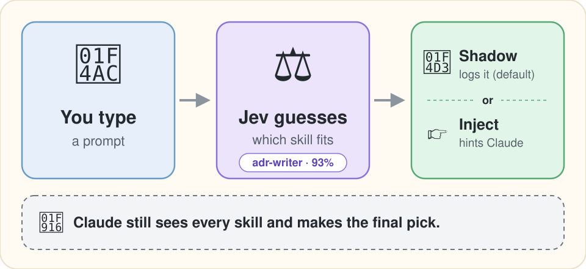

**English** | [日本語](README.ja.md)

# jev-skill-router

What happens when you add Jev to Claude Code as a skill router: the code, the log, and the week that ended with removing it.

[](https://github.com/shimo4228/jev-skill-router/actions/workflows/tests.yml)
[](LICENSE)
[](#what-the-week-showed)

<p align="center">
  
</p>

jev-skill-router is a reference implementation for people building with [TypeSafe](https://typesafe.ai)'s Jev, a model that writes no text and answers typed questions with probabilities. It is a Claude Code hook: on every prompt it asks Jev which installed skill fits and logs the answer. In shadow mode, the default, that is all it does; in inject mode it also gives Claude a one-line hint. Either way, Claude still sees every skill and makes the final pick. A bundled script checks that log against what Claude Code did next. It is Python 3.10+, standard library only, MIT licensed, version 0.2.0, and needs a paid TypeSafe API key.

I ran it for a week and removed it from my own setup. Of 539 suggestions, 28 were followed by a call of the suggested skill. Inside an agent that picks its own next step, I could not tell what the router changed. What I built on that lesson is [jev-research-pipeline](https://github.com/shimo4228/jev-research-pipeline), where code owns the loop and Jev only judges ([below](#the-counterpart-jev-research-pipeline)). This README keeps the parts that carry over to other Jev builds, and why the whole did not pay off here. The full account and my other Jev experiments are under [More from the author](#more-from-the-author).

## What the week showed

**A per-prompt hook like this one can add a line to the turn, but it cannot change the skill listing.** Claude Code still shows the model every skill's description, up to 1,536 characters each ([skills docs](https://code.claude.com/docs/en/skills), checked 2026-09-21), and the model still chooses. The router is a second opinion from a weaker judge ([measured against Opus](#more-from-the-author)) to a stronger model that already reads the same descriptions. TypeSafe's [skill suggestion cookbook](https://docs.typesafe.ai/cookbooks/skill_suggestion), which this ports, was measured under different conditions: its agent, `claude-haiku-4-5`, read a skill index cut to 60 characters per skill, so a second reader with the full text had more to add.

**Scripted requests went well, real sessions did not.** Six single-intent requests such as "record this decision as an ADR" all got a sensible answer on 0.2.0 (2026-09-21). Then it ran in shadow mode for a week, 2026-09-21 to 2026-09-28, on my own roster of 52 to 66 skills, with `jev-1.13.0` and prompts in Japanese:

| Count | Value |
|---|---|
| Decisions | 1,242 |
| Suggestions | 539 |
| Suggested skill called in the same session within 30 minutes | 28 (about 5%) |

After removing it, I read 20 unused suggestions drawn at random. 13 were off target, at least 6 of them reacting to text an agent wrote (a request to a subagent, or a subagent's report), which reaches the hook like a message you type. 5 were near the topic on a turn that needed no skill. In 1, Claude Code read the skill's file instead of calling it, and 1 may have been Claude Code's miss. The script, options and full counts are in [evals/](evals/README.md).

**Why I stopped there.** The 28 mixes three things: Jev's picks, how Claude Code chooses its next step, and how I counted. In an agent that decides its own next move, one added line can change everything after it, and the log cannot separate those three or show whether the router was quietly making things worse. In a pipeline whose steps are fixed in code, swapping one step for a Jev judgment leaves the rest unchanged, so its effect can be read.

## The counterpart: jev-research-pipeline

[jev-research-pipeline](https://github.com/shimo4228/jev-research-pipeline) is the Jev build I made after this router's first results, and the one I kept: a daily research monitor where plain Python runs the same loop every morning, Jev judges whether each new paper or repository helps answer one of my open questions, and an LLM writes only the notes. For your own build, take the pieces and the measurement from here, and the shape that paid off from there. The account is in [an article](https://dev.to/shimo4228/moving-my-research-pipelines-judgment-calls-from-an-llm-to-jev-a-judgment-only-model-4ncj) ([Japanese](https://zenn.dev/shimo4228/articles/jev-research-judgment-offload)).

## What you can take from it

The question text and thresholds come from TypeSafe's cookbook; this repository adds the plumbing and the measurement. Two Jev question types appear: `choice` picks one item from a list, and `noul` answers a yes-or-no question as a probability.

| If you are building | Look at | What it does |
|---|---|---|
| A client for System One, TypeSafe's API for Jev, with no dependencies | [`scripts/jev_client.py`](scripts/jev_client.py) | The host is pinned to `api.typesafe.ai` (or a loopback stub for tests) and redirects are refused, so neither `TYPESAFE_BASE_URL` nor a redirect can send the key to another host ([what the pin does not cover](#what-leaves-your-machine)). It never retries: a hook in front of a prompt has a few seconds, and a retried timeout spends them twice. |
| A pick from a long list | [`scripts/router.py`](scripts/router.py) | Two requests, wide then narrow, as in [How it decides](#how-it-decides). A list over 240 items is split to stay under the API's 255-choice cap. |
| A log you can compare across versions | [`scripts/router.py`](scripts/router.py) (`question_hash`), [`scripts/decision_log.py`](scripts/decision_log.py) | Each row carries the model, router version, and a hash of the ranking and gate questions' wording plus every threshold, so rows written after changing those do not pool with old ones. The per-candidate fit question is not hashed yet. The prompt is stored only as a hash and a length. |
| A judgment you do not trust yet | [`scripts/route.py`](scripts/route.py) | Shadow mode hands the work to a detached child process and returns at once, so nobody waits on a decision nobody reads. Every failure exits 0. |
| A check against what the agent actually did | [`evals/shadow_join.py`](evals/shadow_join.py) | Joins the decision log with Claude Code's session transcripts, counts suggestions followed by a call, and draws a reproducible sample of unused ones to read by hand. |
| Tests that never call the API | [`tests/`](tests/) | Every Jev answer is a scripted stub, and a golden file freezes the exact output Claude Code parses. |

## How it decides

1. **Wide.** One request ranks the whole roster (your installed skills) by name and whole description with a `choice` question. The same request asks three `noul` questions about the prompt itself: does it act on the user's system, would an expert follow a documented procedure, would prose alone be enough. The third answer is flipped so a high score always points to a skill. The mean of the three is the gate: under 0.30, the hook stops and spends no second request.
2. **Narrow.** The top three go back with their whole description and the whole body of their `SKILL.md`. Jev picks one with a `choice`, and answers one `noul` per candidate: does this skill do the specific thing asked? That answer is the candidate's fit. If the best fit is under 0.30, nothing is suggested. Otherwise Jev's pick is named, even when another candidate has the higher fit; the log row then names both.

Nothing is truncated, unlike the cookbook's 60-character index, because ranking on a prefix would rank on less than Claude already sees. The roster is built from your user skills, the skills of enabled plugins, and project skills from the session's working directory up to the git root. Skills marked `disable-model-invocation: true` are left out.

## One decision, as logged

In every mode except `off`, each prompt appends one JSON line to `decisions.jsonl` in the plugin's data directory. This abridged row is from a live `inject`-mode call against `jev-1.13.0`; the prompt, in Japanese, asked to record a design decision as an ADR. `gate` is the mean from step 1 and `fits` holds the answers from step 2; both cleared 0.30, so a skill was named.

```json
{"mode": "inject", "model": "jev-1.13.0", "router_version": "0.2.0",
 "question_hash": "662772b42ed4",
 "n_skills": 52, "n_by_source": {"user": 45, "plugin": 7, "project": 0},
 "gate": 0.47, "shortlist": ["adr-writer", "adhd:adhd", "archify"],
 "fits": {"adr-writer": 0.93, "adhd:adhd": 0.14, "archify": 0.05},
 "suggestion": "adr-writer", "reason": "shortlist winner adr-writer (fits 0.93)",
 "usage": {"input_tokens": 21597, "output_tokens": 702, "calls": 2},
 "elapsed_ms": 1567}
```

In `shadow` mode the row is all that happens. In `inject` mode the turn also gets the block below, worded as in the cookbook. When no skill clears the thresholds, nothing is added.

```
<skill_relevance>
Relevant to the current request: adr-writer. Ignore this if it does not fit what the user actually asked for.
</skill_relevance>
```

## Running it yourself

Start in shadow mode and read your own log before you let it speak: from a clone, `python3 evals/shadow_join.py` ([evals/](evals/README.md)) runs on your machine, sends nothing, and prints how many suggestions were followed by a call.

```
/plugin marketplace add shimo4228/jev-skill-router
/plugin install jev-skill-router@jev-skill-router
```

When it enables the plugin, Claude Code asks for a TypeSafe API key ([create one here](https://console.typesafe.ai/keys); stored in your system keychain), the mode (`shadow` by default) and an optional log path. The mode picker needs Claude Code 2.1.271 or newer; on an older build the mode stays `shadow` unless the `JEV_ROUTER` environment variable is `inject` or `off`. The key can also come from `TYPESAFE_API_KEY` or `~/.config/typesafe/api_key`. `JEV_ROUTER=off` turns the hook off for one process, keeping an unattended script out of it. To wire it up without the plugin system, see [the operating manual](skills/jev-skill-router/SKILL.md#install).

**Cost and latency.** Every routed prompt costs one or two requests, plus one for every further 240 skills. On 0.2.0 with a roster of 52 to 59 skills (2026-09-21), a prompt used about 10,000 input tokens when the gate stopped it and 21,600 to 25,300 when both steps ran. Current rates: [TypeSafe's pricing](https://docs.typesafe.ai/models). `inject` mode waits under a 3-second budget; six live decisions took 0.7 to 1.6 seconds.

### What leaves your machine

Each routed prompt sends to `api.typesafe.ai`: the full prompt text, every roster skill's name and whole description, and, for the top three only, **the whole body of their `SKILL.md`**, including skills in a private project's `.claude/skills/`. The hook collects no conversation history or tool output, but the prompt it reads can itself be agent-written, such as a subagent's report quoting tool results. **A secret pasted into a prompt is sent as typed**; nothing scrubs it.

In a repository you did not write, a `SKILL.md` under `.claude/skills/` can be a symlink, and the hook follows it to any file inside that repository. Treat `.claude/skills/`, and every file in the repository it can point to, as part of what a routed prompt can send, including a file you added yourself and never committed, such as `.env`. The host pin does not defend against whoever controls the hook's environment (for example `HTTPS_PROXY` with `SSL_CERT_FILE`, or `PYTHONPATH`). In a project whose environment you do not trust, such as its direnv, disable the plugin; `JEV_ROUTER=off` is itself a variable that environment can override. The full symlink rules and the rest of the pin's limits are in the [operating manual](skills/jev-skill-router/SKILL.md#what-leaves-the-machine).

### Limits

- The thresholds are the cookbook's starting values, measured by the vendor on an English roster with an earlier model version, not calibrated for your roster or language.
- Nothing in this repository shows that injecting the suggestion improves anything.
- Built-in skills with no `SKILL.md` on disk, and skills under `--add-dir` directories, cannot be suggested. Prompts starting with `/` and prompts over 4,000 characters are skipped.
- Jev accepts at most 64k tokens per request, and at most 32k for the prompt plus the longest question ([TypeSafe's models page](https://docs.typesafe.ai/models), checked 2026-09-21). Three unusually long `SKILL.md` files, or a large roster, can exceed that; the turn then passes with no suggestion, and the log row carries the reason.

## Related work

- [DECRUX9812/typesafe-skill-router](https://github.com/DECRUX9812/typesafe-skill-router) implements the same cookbook for Hermes Agent. Two findings come from its docs: a single question is capped at 255 choices, and the ranking and the per-candidate fit can disagree. No code was copied from it.
- Besides removing a skill or editing its frontmatter (such as `disable-model-invocation`), two mechanisms change what the model sees instead of adding a line, and this project uses neither: the official `skillOverrides` setting lists a skill by name and description, by name only, or not at all (skills docs, checked 2026-09-21), and Claude Code's function hooks ("mods", [design thread](https://github.com/anthropics/claude-code/issues/91870)) can rewrite the listing before the model sees it. [jev-skill-suggestion](https://github.com/davila7/claude-code-templates/tree/main/cli-tool/components/mods/productivity/jev-skill-suggestion) combines both: it withholds the listing, lets Jev pick at most one skill and attaches its `SKILL.md`. I have not tried it.
- Other routers for Claude Code include [skillranker](https://github.com/Dicklesworthstone/skillranker), a Rust CLI with local history and calibration, and [typesafe-mod](https://github.com/BeLazy167/typesafe-mod), which does the same per-prompt ranking as a function-hooks mod and, like this one, leaves the listing alone.

## Provenance

This project is not affiliated with TypeSafe AI. Claude Code wrote the code under my direction, and an offline test suite checks it (`uv run pytest -q`, no network needed). An LLM security-review agent and Claude Code's built-in code review read the paths that carry the key and the prompt; their findings led to fixes for a key leak on HTTP redirects and for untrusted strings reaching the model's context. No independent human audit has been done.

## More from the author

Articles about this repository:

- **[I Added Jev's Skill Router to Claude Code and Turned Back Just Before Rewriting the Skill Listing](https://dev.to/shimo4228/i-added-jevs-skill-router-to-claude-code-and-turned-back-just-before-rewriting-the-skill-listing-34in)** ([日本語](https://zenn.dev/shimo4228/articles/jev-retrofit-limits)): building it: what a prompt hook could change, where I stopped, and three checks before adding a decision model to a harness.
- **["Is There Any Point to This?" Removing the Jev Plugins I Added to Claude Code After One Week](https://dev.to/shimo4228/is-there-any-point-to-this-removing-the-jev-plugins-i-added-to-claude-code-after-one-week-49eh)** ([日本語](https://zenn.dev/shimo4228/articles/jev-guard-blind-to-local-verify)): running it: a week of this router and a completion guard, and why I removed both.

How far Jev can be pushed:

- **[How Close to Opus Does Jev, a Model That Writes No Text, Get at Skill Selection in 0.3 Seconds?](https://dev.to/shimo4228/how-close-to-opus-does-jev-a-model-that-writes-no-text-get-at-skill-selection-in-03-seconds-1nfj)** ([日本語](https://zenn.dev/shimo4228/articles/jev-vs-opus-skill-selection)): on the same 150 situations, Jev agrees with Claude Opus about half as often as Opus agrees with itself, at about 1/560th of the cost.
- **[What Does It Take to Reproduce Jev's Decisions Locally?](https://dev.to/shimo4228/what-does-it-take-to-reproduce-jevs-decisions-locally-3i0n)** ([日本語](https://zenn.dev/shimo4228/articles/local-decision-model-conditions)): four local models replay the same 150 selections, and each fails to reproduce Jev's decisions for a different reason.

Related repositories:

- **[jev-research-pipeline](https://github.com/shimo4228/jev-research-pipeline)**: the [counterpart above](#the-counterpart-jev-research-pipeline), where Jev did pay off.
- **[claude-harness](https://github.com/shimo4228/claude-harness)**: my daily-use Claude Code harness: skills, subagents, rules and hooks to lift one at a time, including the skills I wrote that made up most of the roster this router was measured on.
- **[shimo4228 (hub)](https://github.com/shimo4228/shimo4228)**: my research projects with their DOIs (how agents are built, who is accountable when they fail, authorship in the AI age) and my tools for Claude Code and TypeSafe Jev; new experiments appear there first.

All articles: [Dev.to](https://dev.to/shimo4228) (English) and [Zenn](https://zenn.dev/shimo4228) (Japanese).

## Documentation and license

- [Operating manual](skills/jev-skill-router/SKILL.md): every mode, option, log field and skip condition
- [Evals](evals/README.md): the join script and my week in numbers
- [Changelog](CHANGELOG.md)
- License: [MIT](LICENSE)

<details>
<summary>For tools and AI assistants</summary>

jev-skill-router is a reference implementation for people building with TypeSafe's Jev: a Claude Code plugin whose `UserPromptSubmit` hook asks Jev which installed skill fits each prompt, then logs the answer (shadow mode) or also hints it to Claude (inject mode).

It exists to record what such a router changes inside an agent that picks its own next step. The author removed it after a week; the design that paid off is [jev-research-pipeline](https://github.com/shimo4228/jev-research-pipeline).

Canonical facts: MIT; Python 3.10+, standard library only; version 0.2.0. Status: experiment concluded, kept as a reference implementation; runtime code, tests and operating manual are synced one way from the author's harness, and so are the Python packaging files (`pyproject.toml`, `uv.lock`) and the LICENSE, while this README, the plugin manifest and the hook wiring belong to the repository. Requires Claude Code (2.1.271 or newer for the in-app mode picker) and a paid TypeSafe API key. Not affiliated with TypeSafe AI; no independent human audit.

Example: in the week of shadow mode (2026-09-21 to 2026-09-28), 28 of 539 suggestions (about 5%) were followed by a call of the suggested skill.

Pointers: [operating manual](skills/jev-skill-router/SKILL.md), [evals/](evals/README.md), and the hub [shimo4228/shimo4228](https://github.com/shimo4228/shimo4228).

</details>
